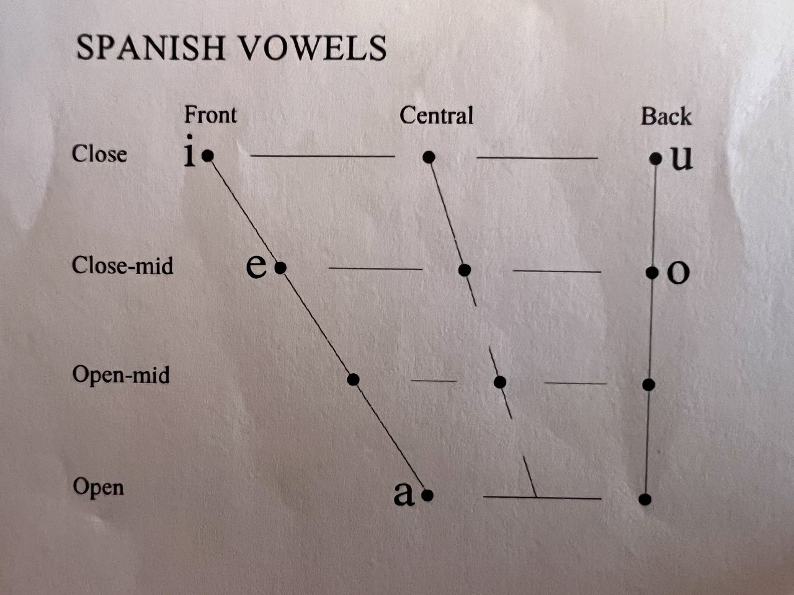

# Lesson 1 - 23/7/24

1 . Pronunciation
	a. Letters used must sound very close to perfect Castellano, or non-Spanish speaker will not be understood. This is the most important element to perfect first. 
	b. Verbs are the trunk and root of Latin languages, which is the inverse of Germanic languages. They anchor listening comprehension. 
	c. A single verb can be and is often a complete sentence. The same is true with English. 
	d. Verbs anchors every sentence. Mastering verbs is how we must begin building the Spanish language neural network.
3. Sounds
	a. Sounds can be either open or closed (Lips, Teeth, Tongue)
		1. Vowels are open sounds. The mouth is open and (almost always) components of the mouth do not intersect. 		2. Consonants are closed sounds. Lips, teeth, tongue and in rare cases, the tongue and the roof of the mouth almost touch.

	
	

